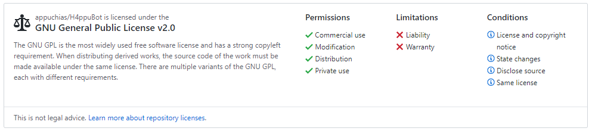

# H4ppu Bot
Bot implementado en el servidor de H4ppu Community para la administración y entretenimiento de los miembros del servidor de Discord

Puedes ver al bot funcionando en el servidor de [H4ppu Community](https://bit.ly/H4ppuC).

>El código **no está optimizado ni para una lectura comprensiva ni para una adaptación sencilla** a otro contexto en Discord.

Lee LICENSE.md para saber más sobre la licencia de uso del repositorio.\
Para ver una versión simplificada:

Considero el feedback muy importante, ya que me hace ver cosas que no había pensado. Para cualquier propuesta, solicitud o bug mándame un correo y te responderé lo antes posible.

Contáctame por [mail](mailto:fernandez.fer.pabloff@gmail.com) (Con asunto `GitHub: H4ppuBot`)

*BOT made with :black_heart: thanks to [discord.py](https://github.com/Rapptz/discord.py)*\
*README by [StackEdit](https://stackedit.io)*
